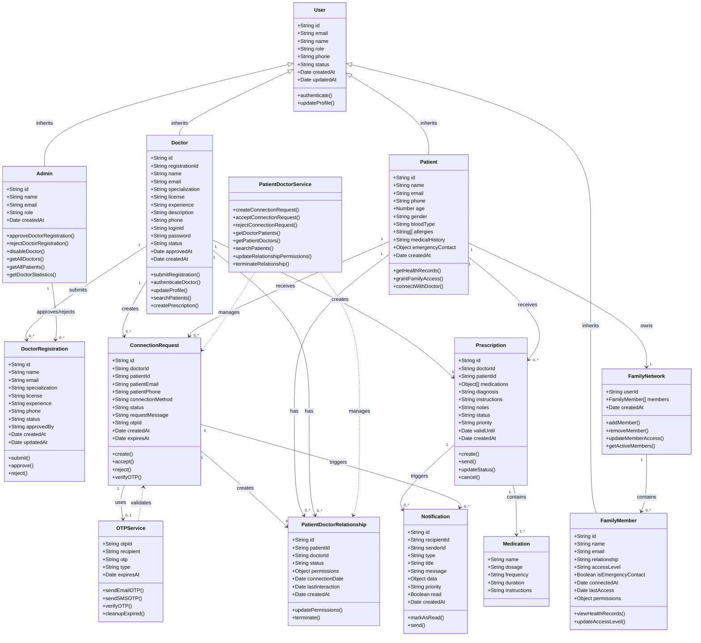

# Swasthyalink Class Diagram

This document contains the class diagram for the Swasthyalink healthcare platform, showing the core models, their attributes, methods, and relationships.

## Class Diagram



## Key Relationships Explained

### Inheritance
- **User** is the base class for Patient, Doctor, Admin, and FamilyMember
- All user types share common attributes (id, email, name, role)

### Associations

#### Doctor Registration Flow
- **Doctor** submits **DoctorRegistration**
- **Admin** approves or rejects **DoctorRegistration**
- Upon approval, Doctor account is created in Users collection

#### Patient-Doctor Connection Flow
- **Doctor** creates **ConnectionRequest** for a **Patient**
- **ConnectionRequest** may use **OTPService** for verification
- Upon acceptance, **PatientDoctorRelationship** is established
- Both **Patient** and **Doctor** can have multiple relationships

#### Prescription Management
- **Doctor** creates **Prescription** for **Patient**
- **Prescription** contains one or more **Medication** objects
- **Prescription** triggers **Notification** to patient

#### Family Network
- **Patient** owns one **FamilyNetwork**
- **FamilyNetwork** contains multiple **FamilyMember** objects
- Each **FamilyMember** has specific access permissions

### Service Dependencies
- **PatientDoctorService** manages ConnectionRequest and PatientDoctorRelationship operations
- **OTPService** validates ConnectionRequest when email/SMS verification is required

## Permissions Model

### PatientDoctorRelationship Permissions
```javascript
{
  viewMedicalHistory: boolean,
  prescribeMedications: boolean,
  scheduleAppointments: boolean,
  accessEmergencyInfo: boolean
}
```

### FamilyMember Permissions
```javascript
{
  prescriptions: boolean,
  records: boolean,
  emergency: boolean
}
```

## Status Enumerations

### ConnectionRequest Status
- `pending` - Awaiting patient response
- `accepted` - Patient accepted, relationship created
- `rejected` - Patient rejected
- `expired` - Request expired (7 days)

### Prescription Status
- `pending` - Created but not sent
- `sent` - Sent to patient
- `received` - Patient acknowledged
- `filled` - Prescription fulfilled
- `cancelled` - Cancelled by doctor or patient

### Doctor Status
- `active` - Approved and active
- `suspended` - Temporarily suspended
- `disabled` - Permanently disabled

---

**Document Version**: 1.0  
**Last Updated**: 2026-02-03  
**Maintained By**: Swasthyalink Development Team
