# Swasthyalink Use Case Diagram

This document contains use case diagrams showing the interactions between different actors and the Swasthyalink healthcare platform.

## System Actors

- **Patient**: Individual seeking healthcare services
- **Doctor**: Healthcare provider managing patients
- **Family Member**: Authorized relative with health record access
- **Admin**: System administrator managing the platform
- **System**: Automated system processes (notifications, AI chatbot)

## Complete Use Case Diagram

```mermaid
graph TB
    %% Actors
    Patient([Patient])
    Doctor([Doctor])
    Family([Family Member])
    Admin([Admin])
    System([System])

    %% Patient Use Cases
    Patient --> UC1[Register Account]
    Patient --> UC2[Login to Portal]
    Patient --> UC3[View Health Records]
    Patient --> UC4[Manage Profile]
    Patient --> UC5[Accept Connection Request]
    Patient --> UC6[Reject Connection Request]
    Patient --> UC7[View Connected Doctors]
    Patient --> UC8[View Prescriptions]
    Patient --> UC9[Grant Family Access]
    Patient --> UC10[Revoke Family Access]
    Patient --> UC11[Update Family Permissions]
    Patient --> UC12[View Notifications]
    Patient --> UC13[Chat with AI Bot]
    Patient --> UC14[Generate QR Code]
    Patient --> UC15[Schedule Appointment]

    %% Doctor Use Cases
    Doctor --> UC20[Register as Doctor]
    Doctor --> UC21[Login to Dashboard]
    Doctor --> UC22[Search Patients]
    Doctor --> UC23[Send Connection Request]
    Doctor --> UC24[View Connected Patients]
    Doctor --> UC25[View Patient Medical History]
    Doctor --> UC26[Create Prescription]
    Doctor --> UC27[Send Prescription]
    Doctor --> UC28[Cancel Prescription]
    Doctor --> UC29[Update Profile]
    Doctor --> UC30[View Connection Requests]
    Doctor --> UC31[Scan Patient QR Code]

    %% Family Member Use Cases
    Family --> UC40[Login to Family Portal]
    Family --> UC41[View Patient Health Records]
    Family --> UC42[View Prescriptions]
    Family --> UC43[Access Emergency Info]
    Family --> UC44[Receive Health Notifications]

    %% Admin Use Cases
    Admin --> UC50[Login to Admin Panel]
    Admin --> UC51[View Pending Registrations]
    Admin --> UC52[Approve Doctor Registration]
    Admin --> UC53[Reject Doctor Registration]
    Admin --> UC54[View All Doctors]
    Admin --> UC55[View All Patients]
    Admin --> UC56[Disable Doctor Account]
    Admin --> UC57[View System Statistics]
    Admin --> UC58[Monitor System Health]

    %% System Use Cases
    System --> UC70[Send Email OTP]
    System --> UC71[Send SMS OTP]
    System --> UC72[Verify OTP]
    System --> UC73[Send Notifications]
    System --> UC74[Process AI Chatbot Queries]
    System --> UC75[Generate Health Insights]
    System --> UC76[Cleanup Expired Requests]

    %% Use Case Relationships (Includes)
    UC23 -.->|includes| UC70
    UC23 -.->|includes| UC71
    UC5 -.->|includes| UC72
    UC26 -.->|includes| UC73
    UC27 -.->|includes| UC73
    UC52 -.->|includes| UC70

    %% Use Case Relationships (Extends)
    UC43 -.->|extends| UC41
    UC31 -.->|extends| UC23

    %% Actor Interactions with System
    UC1 --> System
    UC5 --> System
    UC23 --> System
    UC26 --> System
    UC52 --> System

    style Patient fill:#e1f5ff
    style Doctor fill:#fff4e1
    style Family fill:#f0e1ff
    style Admin fill:#ffe1e1
    style System fill:#e1ffe1
```

## Use Case Details by Actor

### Patient Use Cases

| Use Case ID | Use Case Name | Description |
|-------------|---------------|-------------|
| UC1 | Register Account | Create a new patient account with email/phone |
| UC2 | Login to Portal | Authenticate and access patient dashboard |
| UC3 | View Health Records | View personal medical history and records |
| UC4 | Manage Profile | Update personal information and settings |
| UC5 | Accept Connection Request | Accept doctor's connection request with OTP |
| UC6 | Reject Connection Request | Decline doctor's connection request |
| UC7 | View Connected Doctors | See list of connected healthcare providers |
| UC8 | View Prescriptions | Access all prescriptions from doctors |
| UC9 | Grant Family Access | Add family member with access permissions |
| UC10 | Revoke Family Access | Remove family member access |
| UC11 | Update Family Permissions | Modify family member access levels |
| UC12 | View Notifications | Check system and health notifications |
| UC13 | Chat with AI Bot | Interact with Dialogflow chatbot |
| UC14 | Generate QR Code | Create QR code for quick doctor connection |
| UC15 | Schedule Appointment | Book appointment with connected doctor |

### Doctor Use Cases

| Use Case ID | Use Case Name | Description |
|-------------|---------------|-------------|
| UC20 | Register as Doctor | Submit registration with credentials |
| UC21 | Login to Dashboard | Authenticate and access doctor dashboard |
| UC22 | Search Patients | Search for patients by email/phone/name |
| UC23 | Send Connection Request | Request connection with patient (email/OTP/QR) |
| UC24 | View Connected Patients | See list of connected patients |
| UC25 | View Patient Medical History | Access patient health records (with permission) |
| UC26 | Create Prescription | Create new prescription with medications |
| UC27 | Send Prescription | Send prescription to patient |
| UC28 | Cancel Prescription | Cancel existing prescription |
| UC29 | Update Profile | Modify professional information |
| UC30 | View Connection Requests | Check status of sent connection requests |
| UC31 | Scan Patient QR Code | Scan patient's QR code for quick connection |

### Family Member Use Cases

| Use Case ID | Use Case Name | Description |
|-------------|---------------|-------------|
| UC40 | Login to Family Portal | Authenticate as family member |
| UC41 | View Patient Health Records | Access patient's health information |
| UC42 | View Prescriptions | See patient's prescriptions |
| UC43 | Access Emergency Info | View emergency contact and critical info |
| UC44 | Receive Health Notifications | Get updates about patient's health |

### Admin Use Cases

| Use Case ID | Use Case Name | Description |
|-------------|---------------|-------------|
| UC50 | Login to Admin Panel | Authenticate as system administrator |
| UC51 | View Pending Registrations | See all pending doctor registrations |
| UC52 | Approve Doctor Registration | Approve doctor and create account |
| UC53 | Reject Doctor Registration | Reject doctor registration request |
| UC54 | View All Doctors | List all registered doctors |
| UC55 | View All Patients | List all registered patients |
| UC56 | Disable Doctor Account | Deactivate doctor account |
| UC57 | View System Statistics | See platform usage statistics |
| UC58 | Monitor System Health | Check system status and performance |

### System Use Cases

| Use Case ID | Use Case Name | Description |
|-------------|---------------|-------------|
| UC70 | Send Email OTP | Send one-time password via email |
| UC71 | Send SMS OTP | Send one-time password via SMS |
| UC72 | Verify OTP | Validate user-provided OTP |
| UC73 | Send Notifications | Deliver notifications to users |
| UC74 | Process AI Chatbot Queries | Handle Dialogflow chatbot interactions |
| UC75 | Generate Health Insights | Provide AI-powered health recommendations |
| UC76 | Cleanup Expired Requests | Remove expired connection requests |

## Key Use Case Relationships

### Include Relationships
- **Send Connection Request** includes **Send Email OTP** or **Send SMS OTP**
- **Accept Connection Request** includes **Verify OTP**
- **Create Prescription** includes **Send Notifications**
- **Approve Doctor Registration** includes **Send Email OTP**

### Extend Relationships
- **Access Emergency Info** extends **View Patient Health Records** (only for emergency contacts)
- **Scan Patient QR Code** extends **Send Connection Request** (alternative method)

## Primary Workflows

### Doctor-Patient Connection Workflow
1. Doctor: **Search Patients** (UC22)
2. Doctor: **Send Connection Request** (UC23)
3. System: **Send Email/SMS OTP** (UC70/UC71)
4. Patient: **Accept Connection Request** (UC5)
5. System: **Verify OTP** (UC72)
6. Patient: **View Connected Doctors** (UC7)
7. Doctor: **View Connected Patients** (UC24)

### Prescription Workflow
1. Doctor: **View Patient Medical History** (UC25)
2. Doctor: **Create Prescription** (UC26)
3. Doctor: **Send Prescription** (UC27)
4. System: **Send Notifications** (UC73)
5. Patient: **View Prescriptions** (UC8)
6. Family: **View Prescriptions** (UC42) - if permitted

### Family Access Workflow
1. Patient: **Grant Family Access** (UC9)
2. Family: **Login to Family Portal** (UC40)
3. Family: **View Patient Health Records** (UC41)
4. Family: **View Prescriptions** (UC42)
5. Patient: **Update Family Permissions** (UC11) - as needed

### Doctor Registration Workflow
1. Doctor: **Register as Doctor** (UC20)
2. Admin: **View Pending Registrations** (UC51)
3. Admin: **Approve Doctor Registration** (UC52)
4. System: **Send Email OTP** (UC70)
5. Doctor: **Login to Dashboard** (UC21)

---

**Document Version**: 1.0  
**Last Updated**: 2026-02-03  
**Maintained By**: Swasthyalink Development Team
